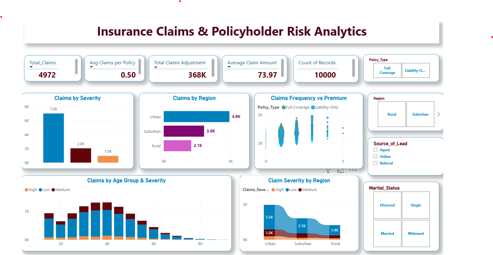

# Insurance Claims & Policyholder Risk Analytics

Interactive dashboard for claims, severity, regional risk, and policyholder analysis.

## 🎯 Purpose

Turn large insurance claims data into a simple, interactive view that helps identify where claims are concentrated and how risk varies across different segments.

## 📊 Dashboard

### 🔍 What You Can Explore

- **Claims & Severity** — Understand overall claim volume and severity.
- **Regional Risk** — Compare claim activity across Urban, Suburban, and Rural areas.
- **Premium Relationship** — Explore how claim frequency relates to premium.
- **Age & Severity** — Identify patterns across different age groups.
- **Policyholder Segments** — Filter results by policy type, lead source, region, and marital status.

## 🛠️ Built With

Power BI · DAX · Power Query

## 💡 Business Impact

Helps transform large claim datasets into **faster, clearer, and more actionable risk analysis**, reducing 
the need for manual data review.
